<!-- CARATULA -->

### Universidad de San Carlos de Guatemala
### Facultad de Ingeniería 
### Escuela de Ciencias y Sistemas 
### Semi 1 
### Proyecto 1 - Grupo 6

 
Audrie Annelisse del Cid Ochoa 201801263 
Diego Alejandro Vasquez

# **Link acceso pagina web S3**
https://archivos-6p1.s3.us-east-2.amazonaws.com/index.html

# **Objetivos del Manual**

- Detallar los conocimientos aplicados durante el proyecto mediante la explicación de los pasos realizados para su elaboración.  
-  Explicar los servicios utilizados para la arquitectura implementada en el proyecto 
- Explicar las razones por las cuales se utilizaron las diferentes tecnologías y servicios en elproyecto
   

# **Explicación de Arquitectura del proyecto**

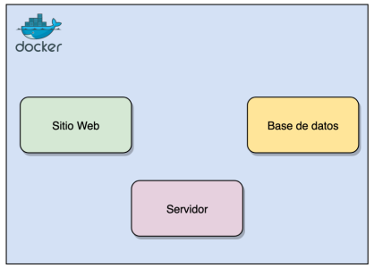

A continuación se explicará de que servicios aws consta la arquitectura y para que se utilizaron.

### VPC
Se hizo uso del servicio VPC que brinda aws para la creación de un red privada aplicada en el proyecto, la cual esta compuesta por una subred privada y 2 subredes públicas.

Para el caso de la subred privada fue utilizada para desplegar la base de datos de la cual se hablará más adelante.
Mientras que las subredes públidas fueron utilizadas para desplegar los servidores.

### RDS

Como anteriormente se mencionó el uso de una base de Datos. Dicha base de datos fue implementada mediante este servicio, siendo necesaria una base relacional. En este caso se utilizó mysql como base de datos y se configuró para que se desplegara en una red privada donde sólo los usuarios involucrados pudieran acceder, esto mediante una configuración de reglas de seguridad de entrada.

### EC2

Se utilizó el servicio de EC2 instancias de aws para el despliegue de 2 máquinas virtuales las cuales mediante la clonación de repositorios creados anteriormente en github, sirven como servidores de la aplicación. Más adelante se mencionará como se maneja el control de estos servidores.

### Load Balancer
Este servicio fue utilizado para el manejo de la peticiones hacia los 2 servidores creados. Permite un mejor flujo en la comunciación hacia dichos servidores.

### S3
Este servicio fue utilizado en esta arquitectura para el despliegue y acceso de recursos de forma pública y se utilizó 2 veces para diferentes funciones.

La primera función fue como bucket, el cual permitía guardar los archivos cargados de la aplicación ya sea texto, pdf, imagen o gift.

La segunda función fue como ayuda para el despliegue del sitio web estático una vez terminado.

   

# **Descripción de cada usuario de IAM creado con las políticas asociadas**

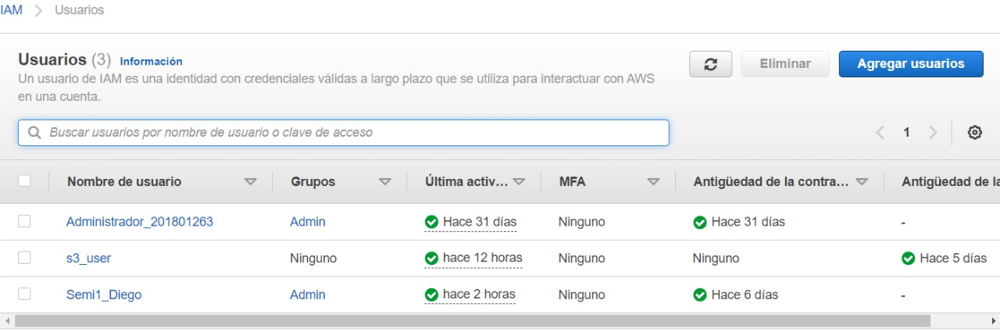

Para la realización de este proyecto se crearon 2 usuarios, los cuales son:

- *Semi1_Diego:* Este usuario fue creado debido a que este proyecto fue realizado por 2 personas, se encesitaba que otra persona ademas del usuario raíz obtuviera permiso para manejar los servicios que consumiría la aplicación. Este usuario contiene todos los permisos de administarador IAM.
- *s3_user:* Este usuario fue creado para el manejo de todo lo relacionado al servicio s3. Se utilizó en los servidores para que pudieran tener acceso a dicho servicio. Este usuario contiene todos los permisos para el acceso a S3.

   

# **Capturas y descripción de como se configuro cada servicio**

## VPC
Para la configuración de este servicio se debe realizar los siguientes pasos.
### 1. Crear VPC

Se debe ir al servicio Vpc y elegir la opción "Crear VPC"
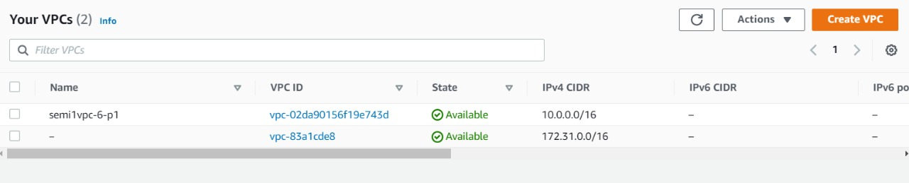
  

Aparecerá la siguiente ventana
 

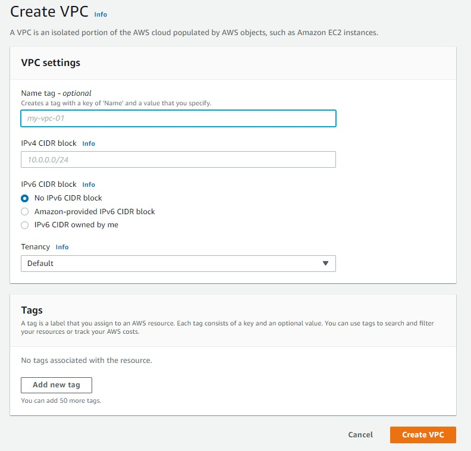
Aquí se debe colocar el nombre de la VPS a crear  y se deja todo por default
  

### 2. Crear subred
En la misma sección del servicio VPC, elegir la opción de subnets. Ya dentro de esto elegir la opción "Crear Subnet", aparecerá la siguiente ventana.

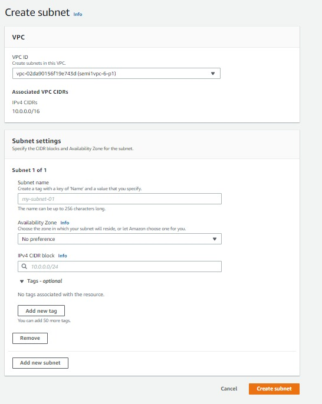
- Se debe elegir la VPC creada en el paso anterior y luego se procede a crear las subnets deseadas. 
- En este caso se crearon 2 subnets públicas, las cuales cuantan con la siguiente dirección ip: 10.0.1.0 y 10.0.3.0
  
Al finalizar la creación de las subnets públicas se debe activar la opción de "Modify auto-assign IP settings" ubicada en las opciónes de "Accion" de la ventana.

En el caso de la subnet privada, se designó la subnet creada por defecto y se le asignó una ip, la cual fue la: 10.0.5.0

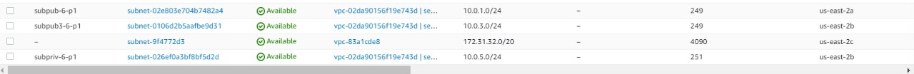
  

### 3. Crear Internet gateway

Para crear el internet gateway se debe dirigir a la sección de "Internet Gateways" ubicada dentro del servicio de VPC. 
Aparecerá la siguiente ventana, acá solo debe ingresar el nombre con el que desea guardarlo.

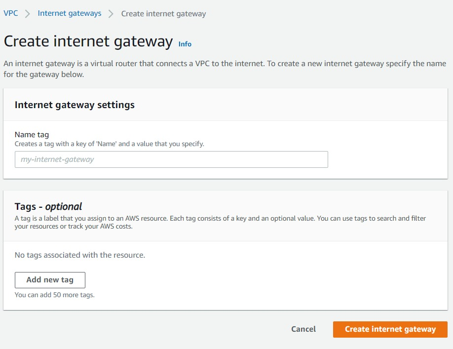
  

Una vez creado se debe activar la opción de "atach VPC" , la cual aparece en la sopciones de "actions".
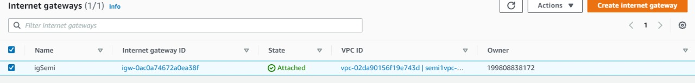
  

### 4. Rout Tables

En la misma ventana del servicio de VPC, en la opción de "Rout Tables" elegir la opción de "Create rout table", aparecerá la siguiente ventana.
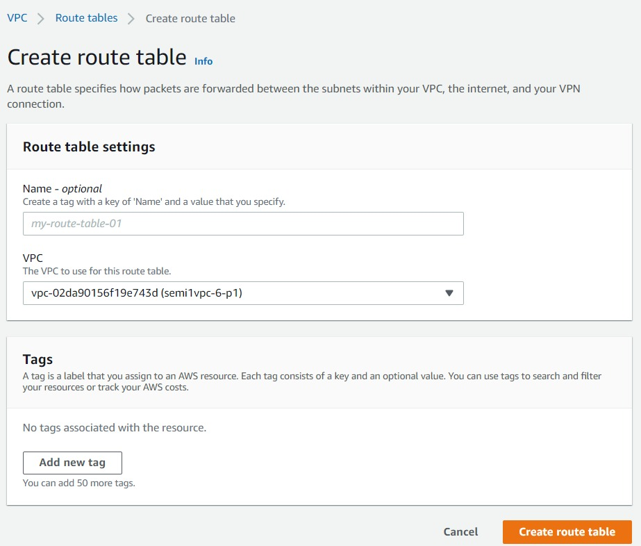
- Se debe elegir la VPC creada anteriormente y colocar un nombre. Este paso es tanto para la subnets públicas como para la privada.
  

Una vez realizado esto seleccionamos la subnet pública y nos dirigimos a su configuración de "Routes". 
Elegimos la opción de "Edit Routes" y colocamos una nueva regla seleccionando el Internet gateway previamente creado.

Luego elegimos la opción de " Subnet associations", aquí elegimos las subnets que deseamos estén en esta configuración, así que elegimos las subnets con los siguientes ids 10.0.1.0 y 10.0.3.0, lo mismo con la privada, pero en ese caso asocia la subnet con ip 10.0.5.0
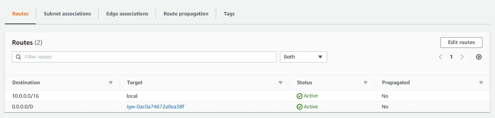
  

Con esto ya tenemos configuradas nuestras "Rout Tables"

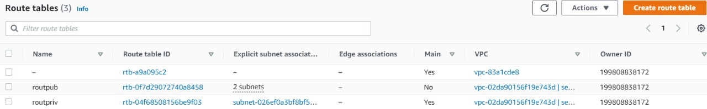
  

## EC2

### 1. Crear llave

Para crear una nueva llave, la cual vamos a utilizar para el acceso a las instancias EC2 que vamos a crear, primero debemos dirigirnos a las opciones de EC2 y seleccionamos la opción "Pares de claves" ubicadas en las opciones de Seguridad.
Una vez en el panel de pares de llaves elegimos crear una nueva, le colocamos un nombre y demos en crear.
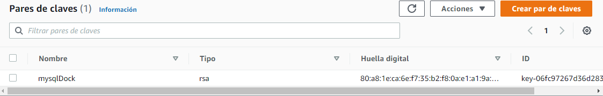
  

### 2. Crear security group

Aquí creamos los grupos de seguridad que nuestras instancias van a requerir.
Para el caso del proyecto creamos 2, la primera fue para que no hubieran problemas de acceso a las EC2 desde el computador de los involucrados mediante la conexión ssh. Se configuró en el puerto 22 y se dejó establecida nuestras ips.
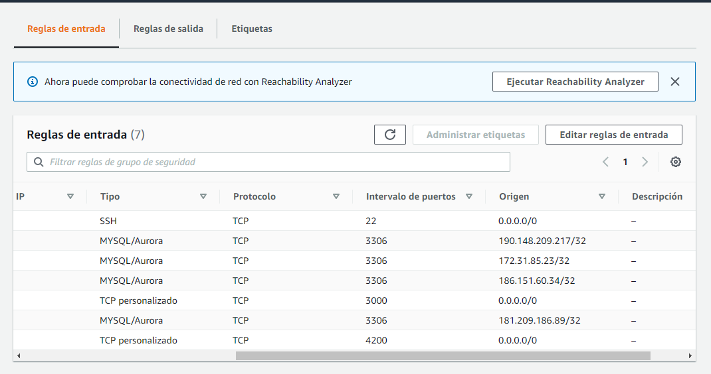
  

El segundo grupo se configuró para que fuera de acceso público en el puerto 3000 que es el puerto donde se desplegarán los servidores.
También se les dio acceso al puerto de la base de datos.
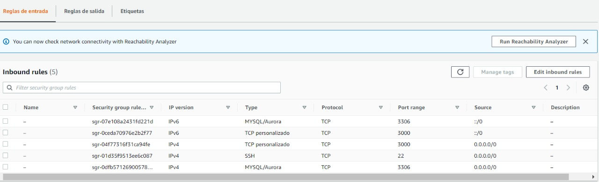
  

### 3. Lanzar EC2

Una vez todo esto estuvo configurado se procedio a crear las instancias EC2. 
La configuración de acontinuación se realizará, fue la misma para las 2 instancias creadas. La única diferencias es al elegir la subnet pública dado que no se deben elegir las mismas subnets, sino que una diferente para cada instancia.

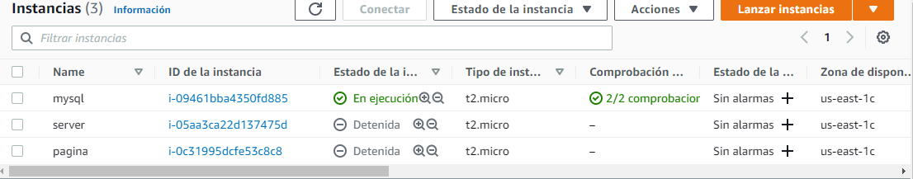
- En las opciones de EC2 nos ubicamos en instancias y seleccionamos la opción de "Lanzar instancia"
  

Aquí nos aparecerán varias opciones de los sistema operativos que podemos elegir. Como estamos en capa gratuita, para este proyecto utilizamos el sistema llamado " Amazon Linux 2 AMI (HVM), SSD Volume Type".
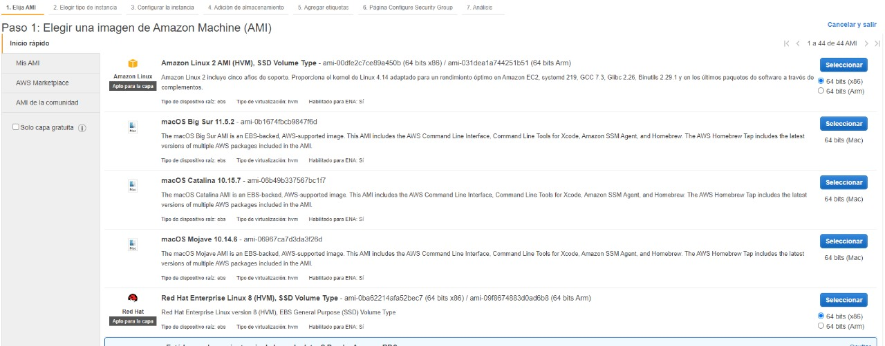
  

A continuacón debemos elegir la opción del tipo de instancia. Para el proyecto elegiremos la opción gratuita de 1 GB de memoria. Una vez elegida damos click en siguiente.

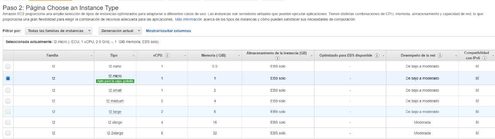
  

Nos aparecerá la siguiente pantalla de configuraciones, aquí elegimos la VPC que vamos a utilizar y la subnet pública. Damos click en siguiente tal y como aparecen las configuraciones hasta encontrar las configuraciones de grupos de seguridad.
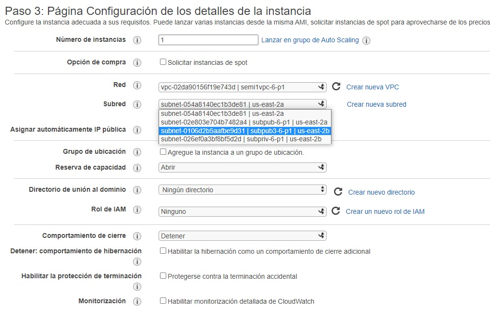
  

Cuando estemos en las configuraciones de grupos de seguridad, nos aparecerá lo siguiente.
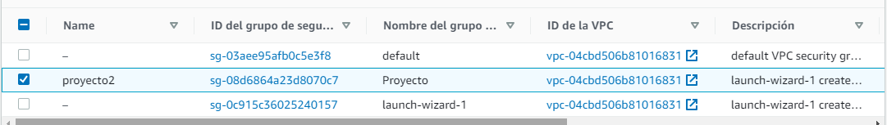
- Elegimos la opción "Seleccionar un grupo de seguridad existente" y elegimos los grupos que previamente configuramos.
  

Damos siguiente hasta finalizar y lanzamos la instancia, aquí nos pedirá la llave con la que queremos lanzar la instancia. Colocamos la llave que hemos creado y la lanzamos.
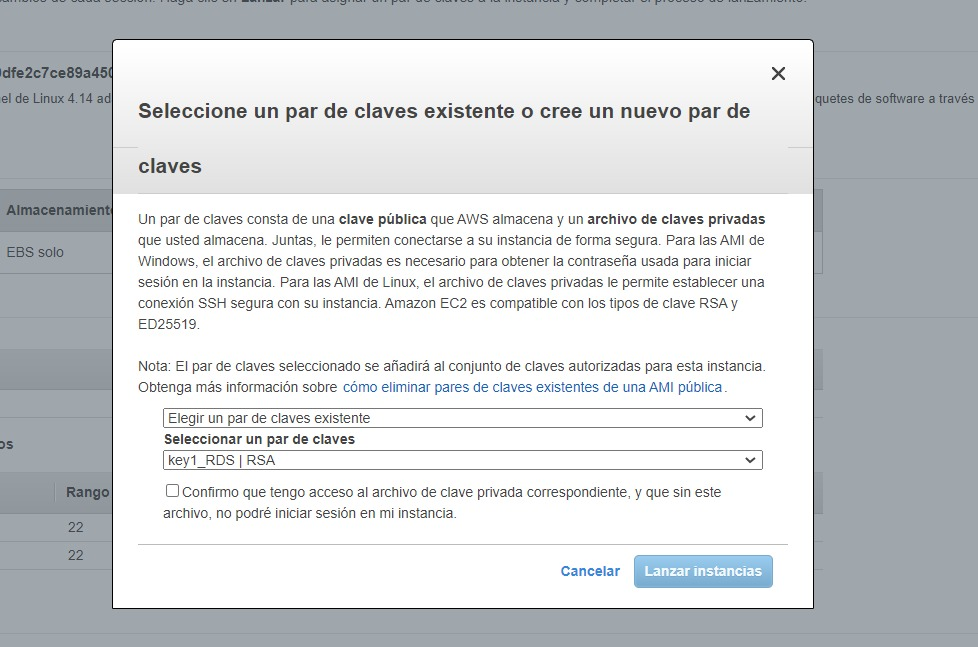
  

## Load Balancer
### 1. Crear traget group
Crearmos un target group y seleccionamos las instancias a las que queremos balancear con el load balancer.
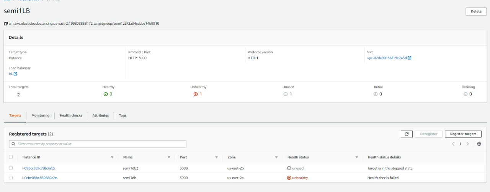
  

### 2. Crear Balanceador
Nos ubicamos en el servicio de Instancias EC2 y seleccionamos la opción de "Equilibrio de carga", aquí elegimos la opción "Balanceadores de carga". 
Una vez dentro, nos aparecerá la siguiente pantalla, aquí damos click en la opción de "Crear balanceador de carga".
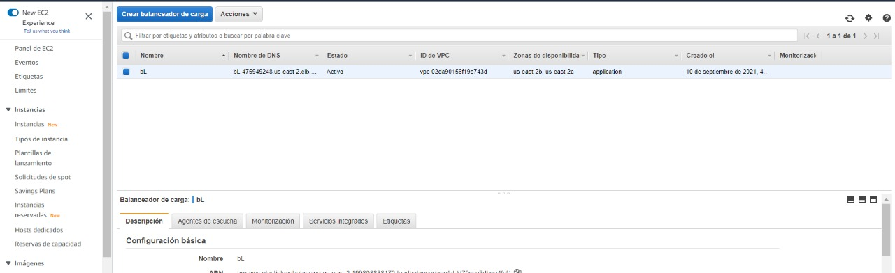
  

Elegimos la opción "Balanceador de carga de aplicaciones"
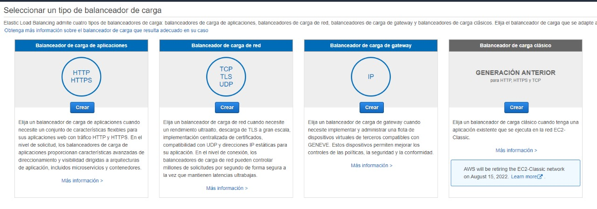
  

Aquí colocamos el nombre del balanceador y la VPC que vamos a utilizar, también habilitamos las zonas en las que  estará distribuyendo el balanceador
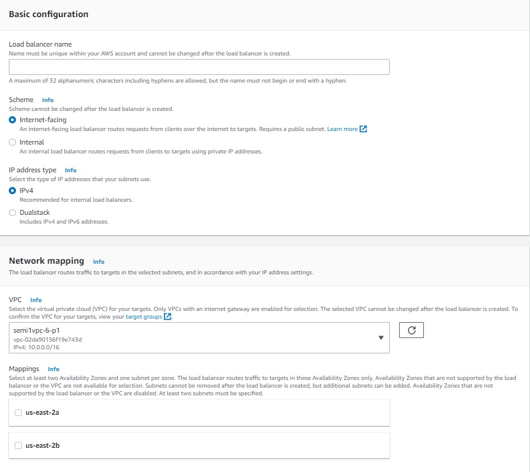
  

También debemos configurar los grupos de seguridad que queremos utilizar y el target group que previamente creamos.
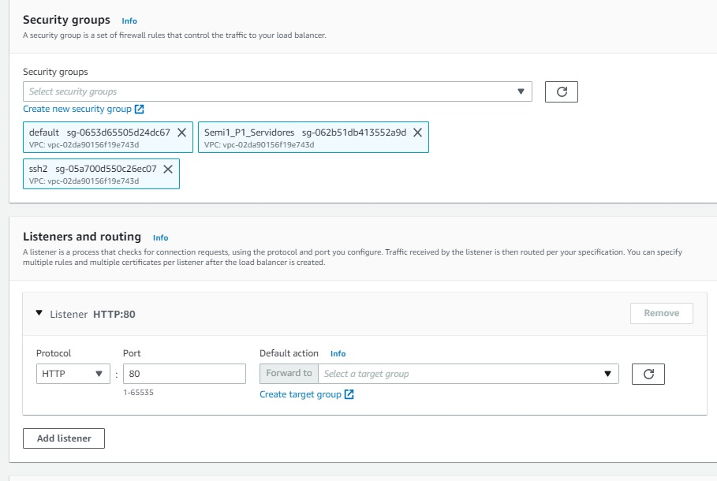
  
 Una vez configurado todo damos click en crear.

## RDS

### 1. Crear base de datos
Primero nos dirigimos al servicio RDS.
Seleccionamos la opción "Crear base de datos" y acontinuación nos parecerá la siguiente ventana.

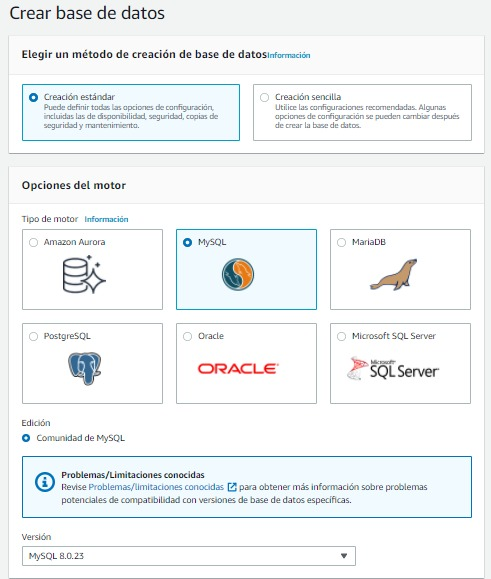
Aquí elegimos la base de datos que deseamos crear, en este caso utilizamos mysql y elegimos la versión por defecto. 
  
Acontinuación aparece la opción de método de pago y en este caso se eligió la opción de capa gratuita.
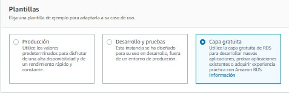
  

Después llenamos los datos de configuración que piden
  
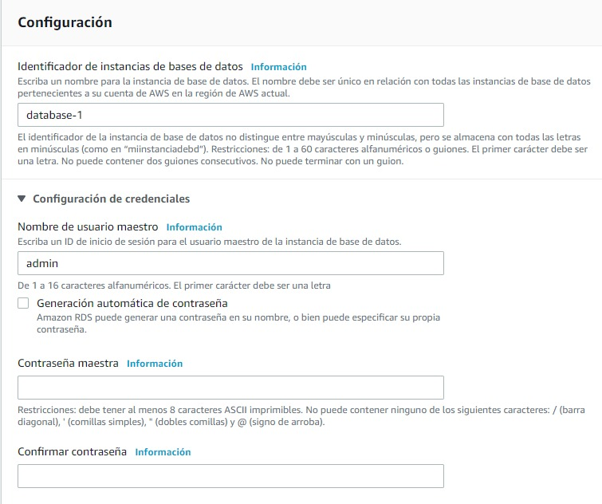
  
Y por último en las opciones de conectividad, elegimos la subred privada y la vpc a la que pertenece. Luego aceptamos todo y esperamos a que se cree nuestra base de datos.
  
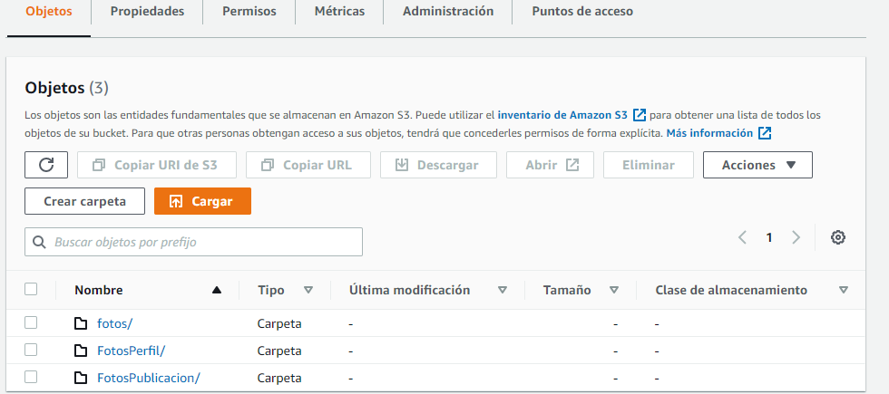
  

### 2. Configurar acceso a la base de datos
Una vez la base de datos ya se encuentre lista y desplegada, se procede a conectar con las EC2 que se van a utilizar
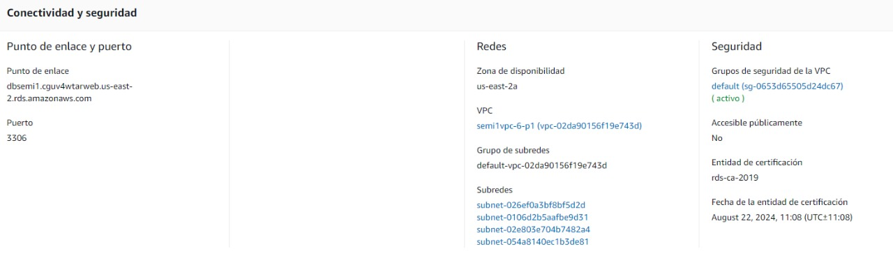
- Aquí procedemos a dirigirnos a la opción  de conectividad y seguridad de la base de datos y seleccionamos la opción "Grupos de seguridad de la vpc"
  

- Una vez dentro procedemos al apartado de "reglas de entrada" y elegimos agregamos 2 nuevas reglas de entrada, las cuales contendran las ipv4 privadas de las EC2 creadas anteriormente, esto para permitirle acceso a la base de datos a los servidores anteriormente desplegados. Estas configuraciones serán del protocolo TCP en el puerto 3306, ya que es el puerto en el que se puede acceder a mysql.
  

## S3
Se crearon 2 Bucket uno para el alamacenamiento de 
  

  

# **Conclusiones**

- Para la conexión de la arquitectura se aplicaron ciertas mezclas de los conocimientos adquiridos ya que en algunos casos para la conexión de estos se necesitaban de más configuraciones referentes a la seguridad, la cuál pudimos tomar ideas de otras configuraciones de los ejemplos vistos en clase.
- Existen diversas opciones para la utilización de un servicio. En este proyecto nos limitamos al uso de las que se encuentran en la capa gratuita.
- Se implementaron las tecnologías mencionadas anteriormente, debido a que se buscaba la creación de un sitio web que cumpliera con ciertas medidas de seguridad respecto al acceso de los datos.