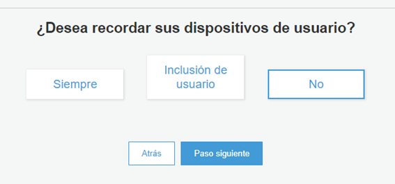
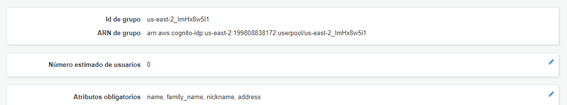

<!-- CARATULA -->

### Universidad de San Carlos de Guatemala
### Facultad de Ingeniería 
### Escuela de Ciencias y Sistemas 
### Semi 1 
### Proyecto 2 - Grupo 6

 
Audrie Annelisse del Cid Ochoa 201801263 
Diego Alejandro Vasquez 201602421

# **Objetivos del Manual**

- Detallar los conocimientos aplicados durante el proyecto mediante la explicación de los pasos realizados para su elaboración.  
-  Explicar los servicios utilizados para la arquitectura implementada en el proyecto 
- Explicar las razones por las cuales se utilizaron las diferentes tecnologías y servicios en elproyecto
   

# **Explicación de Arquitectura del proyecto**

A continuación se explicará de que servicios aws consta la arquitectura y para que se utilizaron.

### EC2

Se utilizó el servicio de EC2 instancias de aws para el despliegue de 3 máquinas virtuales las cuales mediante la clonación de repositorios creados anteriormente en github, sirven como servidores de la aplicación. Más adelante se mencionará como se maneja el control de estos servidores.

### S3
Este servicio fue utilizado en esta arquitectura para el despliegue y acceso de recursos de forma pública y se utilizó 2 veces para diferentes funciones.

La primera función fue como bucket, el cual permitía guardar los archivos cargados de la aplicación ya sea texto, pdf, imagen o gift.

La segunda función fue como ayuda para el despliegue del sitio web estático una vez terminado.

   

# **Descripción de cada usuario de IAM creado con las políticas asociadas**

Para la realización de este proyecto se crearon 2 usuarios, los cuales son:

- *Semi1_Diego:* Este usuario fue creado debido a que este proyecto fue realizado por 2 personas, se encesitaba que otra persona ademas del usuario raíz obtuviera permiso para manejar los servicios que consumiría la aplicación. Este usuario contiene todos los permisos de administarador IAM.
- *s3_user:* Este usuario fue creado para el manejo de todo lo relacionado al servicio s3. Se utilizó en los servidores para que pudieran tener acceso a dicho servicio. Este usuario contiene todos los permisos para el acceso a S3.
- *Diego_Vasquez2:* Se utilizo este usuario para almacenar 3 instancias EC2 cada instancia almacena una parte del proyecto.

   

# **Capturas y descripción de como se configuro cada servicio**

## EC2

### 1. Crear llave

Para crear una nueva llave, la cual vamos a utilizar para el acceso a las instancias EC2 que vamos a crear, primero debemos dirigirnos a las opciones de EC2 y seleccionamos la opción "Pares de claves" ubicadas en las opciones de Seguridad.
Una vez en el panel de pares de llaves elegimos crear una nueva, le colocamos un nombre y demos en crear.

  

### 2. Crear security group

Aquí se creo un grupo de seguridad que almacena todas las ips de las maquinas, para que estas se conecten entre si las conecciones tipo Mysql/Aurora son para poder conectarse a la instancias mysql. Y los TCP pesonalizados son para poder ejecutar tanto el frontend, como las peticiones del backend en los puertos 4200 y 3000 respectivamente.

  

### 3. Lanzar EC2

Una vez todo esto estuvo configurado se procedio a crear las instancias EC2. 
La configuración de acontinuación se realizará, fue para la primera instancia. ahora con la primera instancia creada, y con docker instalado en esta, se procedio a crear una imagen de dicha EC2, esta imagen fue usada para crear las otras 2 instancias, con las mismas caracteristicas a la primera y al probarlas estas ya tenina docker instalado.

- En las opciones de EC2 nos ubicamos en instancias y seleccionamos la opción de "Lanzar instancia"
  

Aquí nos aparecerán varias opciones de los sistema operativos que podemos elegir. Como estamos en capa gratuita, para este proyecto utilizamos el sistema llamado " Amazon Linux 2 AMI (HVM), SSD Volume Type".

  

A continuacón debemos elegir la opción del tipo de instancia. Para el proyecto elegiremos la opción gratuita de 1 GB de memoria. Una vez elegida damos click en siguiente.

  

Cuando estemos en las configuraciones de grupos de seguridad, nos aparecerá lo siguiente.

- Elegimos la opción "Seleccionar un grupo de seguridad existente" y elegimos el grupo llamado proyecto2
  

Damos siguiente hasta finalizar y lanzamos la instancia, aquí nos pedirá la llave con la que queremos lanzar la instancia. Colocamos la llave que hemos creado y la lanzamos.

  

## S3
Se hizo uso de un solo bucket el cual almacena todas las imagenes que son subidas a la base de datos en la instancia mysql
  

  

## Cognito

1.	Dirigirse a Administrar grupo de usuarios

  

  

2.	Seleccionar la opción: Crear un grupo de usuarios

  

  

3.	Colocar nombre y seleccionar “Recorrido por la configuración”

  

  

4.	Seleccionar que el inicio de sesión sea mediante el nombre de “Usuario”

  

  

5.	Se eligen los atributos del usuario y se da click en “Paso siguiente”

  

  

6.	Decidir como deseo que sea la contraseña y dejar que los usuarios puedan registrarse, luego dar click en “Paso Siguiente”

  

  

7.	Nos llevará a una nueva página, dejaremos todo por defecto

  

  

  

  

8.	Damos click en “Paso Siguiente”, nos aparecerá la siguiente ventana y también dejaremos todo por defecto.

  

  

9.	Damos click en  “No” y continuamos

  

  

10.	Nos aparecerá la siguiente ventana y daremos click en “Añadir un cliente de aplicación”

  

  

11.	Nos aparecerá la siguiente ventana, en la cual podremos agregar los accesos a los usuarios creados mediante cognito. Procedemos a colocar un nombre y habilitar la opción de autenticación mediante contraseña y nombre de usuario. También deshabilitamos la opción “Generar clave secreta del cliente”

  

  

12.	Damos click en “Crear un cliente de aplicación”

  

  

13.	Nos aparecerá la siguiente ventana, damos click en “Paso siguiente”

  

  

14.	Aquí nos aparecerán las siguientes opciones las cuales permiten activar una función lambda para usos específicos. Damos click en “Paso Siguiente”

  

  

15.	Nos mostrará un resumen de todas las configuraciones realizadas

  

  

16.	Por último damos click en “Crear grupo”

  

  

17.	Una vez creado el grupo nos aparecerá el Id del grupo y el ARN de grupo
us-east-2_ImHx8w5i1

  

  

18.	También puedo revisar los datos del Cliente creado anteriormente en la opción de “Clientes de aplicación”. Aquí se encuentran datos para conectarnos desde le backend.

  

  

19.	Una vez finalizado el grupo de usuarios se procede a modificar los links para la verificación de la cuenta. En Configuración del cliente de aplicación agregamos una nueva url

  

  

20.	Y En el nombre del domino agregamos un nuevo dominio.

  

  

# **Usuarios IAM**

  

  

Se utilizaron los siguientes usuarios:
* Se utilizó el usuario Rekognition_user, este usuario otorga todos los permisos necesarios para el uso de la herramienta Rekognition.
* Se utilizó el usuario s3_user, este usuario otorga todos los permisos necesarios para el uso de la herramienta S3.
* Se utilizó el usuario usuarioTranslate, este usuario otorga todos los permisos necesarios para el uso de la herramienta Translate.