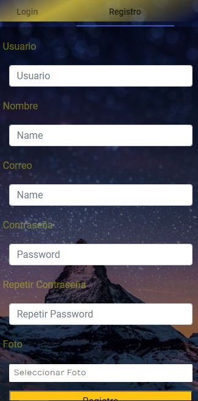
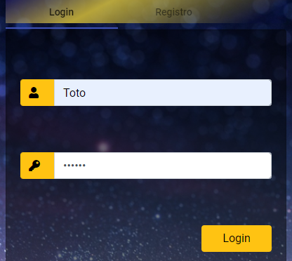
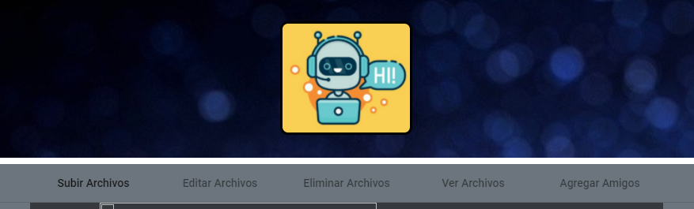
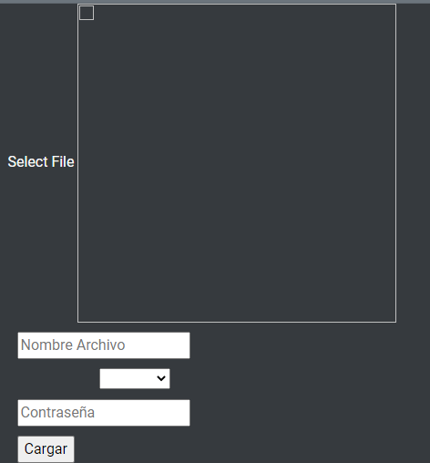
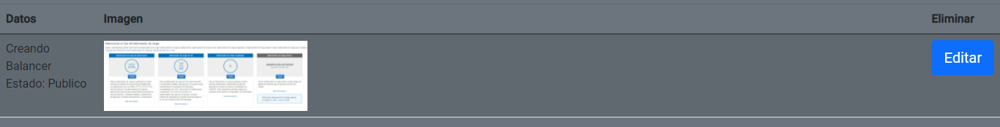
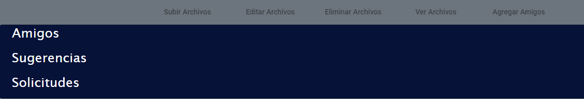

<!-- CARATULA -->

### Universidad de San Carlos de Guatemala
### Facultad de Ingeniería 
### Escuela de Ciencias y Sistemas 
### Semi 1 
### Proyecto 1 - Grupo 6

 

# **Objetivos del Manual**

- Otorgar explicaciones detalladas de la funcionalidad de la aplicacion  
- Mostar la facilidad del uso a los usuarios 
   

# **Funciones**

### Registro

En la pagina de inicio de la pagina se muestra dos 2 secciones:
 

- Login
- Registro

 
En la seccion de registro apareceran todos los campos que el usuario debera llenar para su registro. Luego de llenar todos los campos y elegir una imagen de perfil debera oprimir el boton REGISTRO. 
 

   

### Login

  

En esta Seccion el Usuario unicamente ingresara sus datos Oprimir el boton Login, e inmediatamente se redigira a la
pantalla principal con su usuario.
  

  
La pagina principal del usuario mostrar esta interfaz de seleccion para navegar entre la plataforma
  

## Subir Archivo

 

En esta seccion el usuario subira un archivo entre los que se estan permitidos:
 

- PDF
- TXT
- Imagen (JPG o PNG)
 
luego ingresara el nombre con el que quiere subir la imagen, y seleccionara si quiere que esta sea publica o privada, ya para concluir debera ingresar su contraseña, esto por motivos de seguridad.
 

## NOTA: Todas las acciones requieren verificar la contraseña del usuario para ejecutarse.

 
  

## Editar o Eliminar
 

  

Las Secciones Editar y Eliminar son similares el usuario elige cual editar y cual eliminar al oprimir el boton correspodiente al archivo con el que se desea realizar la accion se despliega una seccion extra. En el caso de editar, el usuario elegira si quiere cambiar el estado de la imagen de PUBLICA a PRIVADA o viceversa.
En el caso de ELIMINAR solo es necesario la confirmacion de contraseña
 

## Seccion amigos

 

  

En esta seccion encontraremos 3 Sub-Secciones:
 

- Amigos
- Sugerencias
- Solicitudes

 
En la seccion AMIGOS, se visualizaran todos los usuarios a los que el usuario principal acepto como amigos.
En la seccion SUGERENCIAS es donde al usuario se le mostraran todas las opciones de amistad que tiene disponibles a las cuales podra mandar solicitud de amistad. Y por ultimo la seccion SOLICITUDES aqui el usuario visualizara todas la solicitudes de amistad enviadas por otros usuarios, y este elige si aceptarlas o rechazarlas.

## Ver Archivos
 

En esta seccion se mostraran todos los archivos subidos como publicos a la plataforma por todos los usuario.
NOTA: solo visualizara lo archivos subidos por usuario que acepto como amigos.